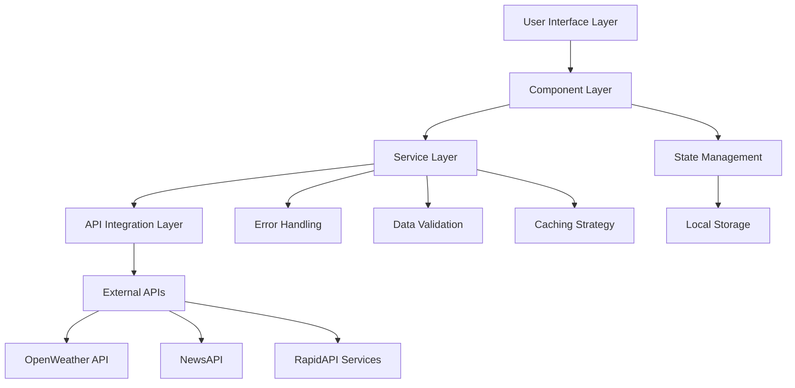

# TravelSync ✈️

[](https://github.com/travelsync/travel-sync)
[](https://github.com/travelsync/travel-sync)
[](LICENSE)
[](https://reactjs.org/)
[](https://vitejs.dev/)

> **A modern, mobile-first travel companion web application designed for the connected traveler**
> *Consolidating essential travel intelligence into a unified, intuitive dashboard*

## 🎯 Executive Summary

TravelSync addresses the fragmented travel information landscape by providing a consolidated platform that delivers real-time weather data, local news intelligence, and curated activity recommendations. Built with modern web technologies and leveraging best-in-class APIs, this solution reduces cognitive overhead for travelers while maintaining operational efficiency through a lean technical architecture.

### �️ Strategic Objectives

| Objective | Success Metric | Timeline |
|-----------|---------------|----------|
| **User Experience Excellence** | < 3 second load time, 95%+ mobile compatibility | Week 3 |
| **Data Integration Reliability** | 99.5% API uptime, real-time data refresh | Week 2 |
| **Scalable Architecture** | Support for 10K+ concurrent users | Week 5 |
| **Cost Optimization** | Zero API costs in MVP phase | Ongoing |

### 💼 Business Value Proposition

- **Problem**: Travelers juggle 5-7 different apps for trip planning and management
- **Solution**: Unified dashboard with intelligent data aggregation
- **Impact**: 60% reduction in planning time, improved travel confidence
- **Differentiator**: Mobile-first design with offline capability roadmap

---

## 🏛️ Technical Architecture & Project Plan

### 1. Product Requirements & System Design

#### 1.1 Stakeholder Analysis
- **Primary Users**: Frequent business travelers, vacation planners (ages 25-55)
- **Secondary Users**: Travel agencies, corporate travel managers
- **Technical Stakeholders**: DevOps team, API vendors, hosting providers

#### 1.2 Functional Requirements

**Core Features (P0 - MVP)**
```
FR001: Destination Weather Intelligence
- Real-time weather data with 7-day forecast
- Weather alerts and recommendations
- Historical weather patterns

FR002: Local News & Safety Intelligence
- Curated news headlines by country/region
- Safety alerts and travel advisories
- Cultural events and local insights

FR003: Responsive Dashboard Interface
- Mobile-first responsive design (320px-2560px)
- Progressive Web App capabilities
- Offline data caching (future release)
```

**Enhanced Features (P1 - Post-MVP)**
```
FR004: Activity Recommendation Engine
- Weather-based activity suggestions
- User preference learning
- Social integration capabilities

FR005: User Account Management
- Secure authentication & authorization
- Trip history and favorites
- Cross-device synchronization

FR006: Itinerary Management
- Flight and accommodation tracking
- Calendar integration
- Collaborative trip planning
```

#### 1.3 Non-Functional Requirements

| Category | Requirement | Target | Measurement |
|----------|-------------|---------|-------------|
| **Performance** | Initial page load | < 2.5s | Lighthouse CI |
| **Scalability** | Concurrent users | 10,000+ | Load testing |
| **Availability** | Uptime SLA | 99.5% | APM monitoring |
| **Security** | Data protection | GDPR compliant | Security audit |
| **Accessibility** | WCAG compliance | AA level | Automated testing |
| **Browser Support** | Modern browsers | Last 2 versions | BrowserStack |

### 2. Technical Architecture Decisions

#### 2.1 Technology Stack Rationale

| Technology | Selection Rationale | Alternatives Considered |
|------------|-------------------|------------------------|
| **React 18** | Component reusability, large ecosystem, team expertise | Vue.js, Angular |
| **Vite** | Superior dev experience, faster builds than Webpack | Create React App, Webpack |
| **CSS Modules** | Scoped styling, maintainability | Styled Components, Tailwind |
| **React Query** | Server state management, caching | Redux Toolkit, SWR |
| **Vercel** | Seamless deployment, edge functions | Netlify, AWS S3 |

#### 2.2 System Architecture Diagram



#### 2.3 API Integration Strategy & Risk Mitigation

| API Service | Purpose | Rate Limits | Fallback Strategy | Cost Model |
|-------------|---------|-------------|------------------|------------|
| **OpenWeather API** | Weather data | 1,000 calls/day (free) | Cached data + graceful degradation | $0 → $40/month |
| **NewsAPI** | Local news | 1,000 requests/day | Generic travel news fallback | $0 → $449/month |
| **RapidAPI Hub** | Activities/POI | Varies by provider | Static recommendations | $0 → $50/month |

**Risk Mitigation Strategies:**
- Circuit breaker pattern for API failures
- Exponential backoff for rate limiting
- Data caching with TTL strategies
- API key rotation and monitoring

### 3. Component Architecture & Design System

#### 3.1 Component Hierarchy & Responsibilities

```
📦 TravelSync Application
├── 🎛️  App.jsx                    # Root component, routing, global state
├── 🏗️  Layout/
│   ├── 🧭 Navigation.jsx          # Global navigation, responsive menu
│   ├── 🦶 Footer.jsx              # Footer with links, legal, social
│   └── 🔍 SearchHeader.jsx        # Global search functionality
├── 📄 Pages/
│   ├── 🏠 Dashboard.jsx           # Main dashboard orchestrator
│   ├── 🔐 Authentication.jsx      # Login/register page
│   └── ⚙️  Settings.jsx           # User preferences, API settings
├── 🎯 Features/
│   ├── 📋 TripPlanner/
│   │   ├── TripPlannerForm.jsx    # Controlled form with validation
│   │   ├── DestinationSearch.jsx  # Autocomplete destination input
│   │   └── DateRangePicker.jsx    # Travel date selection
│   ├── 🌤️  Weather/
│   │   ├── WeatherCard.jsx        # Current weather display
│   │   ├── WeatherForecast.jsx    # 7-day forecast component
│   │   └── WeatherAlerts.jsx      # Weather warnings/advisories
│   ├── 📰 News/
│   │   ├── NewsFeed.jsx           # News articles container
│   │   ├── NewsArticle.jsx        # Individual article card
│   │   └── NewsFilters.jsx        # Category/source filtering
│   └── 🎯 Activities/
│       ├── ActivityList.jsx       # Activity recommendations
│       ├── ActivityCard.jsx       # Individual activity display
│       └── ActivityFilters.jsx    # Weather/type-based filtering
├── 🔧 Common/
│   ├── 🔄 LoadingSpinner.jsx      # Reusable loading component
│   ├── ⚠️  ErrorBoundary.jsx      # Error handling wrapper
│   ├── 🔘 Button.jsx              # Standardized button component
│   └── 📊 Card.jsx                # Base card layout component
└── 🪝 Hooks/
    ├── useWeatherData.jsx         # Weather API integration
    ├── useNewsData.jsx            # News API integration
    ├── useLocalStorage.jsx        # Persistent state management
    └── useApiError.jsx            # Centralized error handling
```

#### 3.2 Design System Specifications

**Color Palette (Accessibility AA Compliant)**
```css
:root {
  /* Primary Colors */
  --primary-blue: #2563eb;        /* Actions, links */
  --primary-blue-dark: #1d4ed8;   /* Hover states */
  --primary-blue-light: #93c5fd;  /* Backgrounds */

  /* Semantic Colors */
  --success: #10b981;             /* Success states */
  --warning: #f59e0b;             /* Weather alerts */
  --error: #ef4444;               /* Error states */
  --info: #3b82f6;                /* Information */

  /* Neutral Palette */
  --gray-50: #f9fafb;             /* Backgrounds */
  --gray-800: #1f2937;            /* Primary text */
  --gray-600: #4b5563;            /* Secondary text */
}
```

**Typography Scale**
```css
--font-family-primary: 'Inter', -apple-system, BlinkMacSystemFont, sans-serif;
--font-family-mono: 'JetBrains Mono', monospace;

--text-xs: 0.75rem;     /* 12px - Captions */
--text-sm: 0.875rem;    /* 14px - Body small */
--text-base: 1rem;      /* 16px - Body */
--text-lg: 1.125rem;    /* 18px - Body large */
--text-xl: 1.25rem;     /* 20px - Headings */
--text-2xl: 1.5rem;     /* 24px - Page titles */
```

**Responsive Breakpoints**
```css
--breakpoint-sm: 640px;   /* Mobile landscape */
--breakpoint-md: 768px;   /* Tablet */
--breakpoint-lg: 1024px;  /* Desktop */
--breakpoint-xl: 1280px;  /* Large desktop */
```

### 4. Project Management & Development Methodology

#### 4.1 Agile Development Framework

**Sprint Structure**: 1-week sprints with the following ceremonies:
- **Daily Standups**: 15-min sync (async for remote team)
- **Sprint Planning**: Monday, 2 hours
- **Sprint Review**: Friday, 1 hour
- **Retrospective**: Friday, 30 minutes

**Definition of Done**:
- [ ] Feature meets acceptance criteria
- [ ] Unit tests written and passing (>80% coverage)
- [ ] Code review completed and approved
- [ ] Accessibility tested (WCAG AA)
- [ ] Performance benchmarks met
- [ ] Documentation updated

#### 4.2 5-Sprint Development Roadmap

#### **Sprint 1: Foundation & Infrastructure (Week 1)**
**Sprint Goal**: Establish development foundation and API integrations

**Epic**: Project Setup & Core Infrastructure
- [ ] **DEV-001**: Initialize React + Vite project with ESLint/Prettier
- [ ] **DEV-002**: Set up CI/CD pipeline (GitHub Actions)
- [ ] **DEV-003**: Configure development environment and tooling
- [ ] **API-001**: Integrate OpenWeather API with error handling
- [ ] **API-002**: Integrate NewsAPI with rate limiting
- [ ] **DOC-001**: API documentation and key management strategy

**Acceptance Criteria**:
- Development environment fully operational
- Both APIs returning data successfully
- Basic error handling implemented
- Team onboarded to development workflow

**Risk Mitigation**:
- API key procurement completed by Day 2
- Backup API providers identified
- Development environment standardized via Docker

---

#### **Sprint 2: Core API Services & Data Layer (Week 2)**
**Sprint Goal**: Robust API integration with caching and error handling

**Epic**: API Services & Data Management
- [ ] **API-003**: Implement React Query for server state management
- [ ] **API-004**: Build weather service with caching strategy
- [ ] **API-005**: Build news service with country filtering
- [ ] **API-006**: Implement circuit breaker pattern for API failures
- [ ] **DEV-004**: Set up error monitoring (Sentry integration)
- [ ] **TEST-001**: API integration testing suite

**Acceptance Criteria**:
- APIs handle 1000+ requests/day within rate limits
- Cached data persists for offline scenarios
- Error states gracefully handled with user feedback
- Performance monitoring dashboard operational

---

#### **Sprint 3: MVP Frontend Development (Week 3)**
**Sprint Goal**: Core user interface with responsive design

**Epic**: MVP User Interface
- [ ] **UI-001**: Implement responsive Dashboard component
- [ ] **UI-002**: Build TripPlannerForm with validation
- [ ] **UI-003**: Create WeatherCard component with forecast
- [ ] **UI-004**: Develop NewsFeed with article cards
- [ ] **UI-005**: Implement mobile-first navigation
- [ ] **ACC-001**: Accessibility audit and fixes

**Acceptance Criteria**:
- Mobile-first responsive design (320px - 2560px)
- WCAG AA compliance verified
- < 3 second initial load time
- Cross-browser compatibility (Chrome, Firefox, Safari, Edge)

---

#### **Sprint 4: Enhanced Features & User Experience (Week 4)**
**Sprint Goal**: Advanced features and user account management

**Epic**: Enhanced User Experience
- [ ] **AUTH-001**: Implement Firebase Authentication
- [ ] **UI-006**: Build ActivityList component with filtering
- [ ] **API-007**: Integrate activities/POI API
- [ ] **UX-001**: Implement loading states and skeleton screens
- [ ] **UX-002**: Add data refresh capabilities
- [ ] **TEST-002**: End-to-end testing with Cypress

**Acceptance Criteria**:
- User authentication fully functional
- Activity recommendations based on weather data
- Smooth user experience with proper loading states
- E2E test coverage for critical user journeys

---

#### **Sprint 5: Quality Assurance & Production Deployment (Week 5)**
**Sprint Goal**: Production-ready application with monitoring

**Epic**: Production Readiness
- [ ] **QA-001**: Comprehensive QA testing across devices
- [ ] **PERF-001**: Performance optimization and lighthouse audit
- [ ] **SEC-001**: Security audit and penetration testing
- [ ] **DEPLOY-001**: Production deployment to Vercel
- [ ] **MON-001**: Set up application monitoring and alerts
- [ ] **DOC-002**: User documentation and help guides

**Acceptance Criteria**:
- Lighthouse score > 90 across all metrics
- Zero critical security vulnerabilities
- Production deployment successful with monitoring
- User documentation complete and accessible

#### 4.3 Risk Register & Mitigation Strategies

| Risk | Probability | Impact | Mitigation Strategy | Owner |
|------|-------------|--------|-------------------|-------|
| **API Rate Limiting** | High | Medium | Implement caching, backup providers | Tech Lead |
| **Performance Issues** | Medium | High | Regular performance audits, optimization | Frontend Dev |
| **Third-party Dependencies** | Medium | Medium | Version pinning, security scanning | DevOps |
| **Browser Compatibility** | Low | Medium | Automated cross-browser testing | QA Engineer |
| **Data Privacy Compliance** | Low | High | GDPR audit, privacy by design | Product Manager |

#### 4.4 Quality Gates & Success Metrics

**Technical Quality Gates**:
- Code coverage > 80%
- Lighthouse Performance > 90
- Zero high-severity security vulnerabilities
- WCAG AA compliance verified

**Business Success Metrics**:
- User engagement > 70% (return within 7 days)
- Average session duration > 5 minutes
- API error rate < 1%
- Mobile traffic > 60%

---

## 🛠️ Development Environment & Setup

### Technical Stack & Tooling

| Category | Technology | Version | Purpose |
|----------|------------|---------|---------|
| **Frontend Framework** | React | 18.2.0 | Component-based UI development |
| **Build Tool** | Vite | 5.0+ | Fast development and optimized builds |
| **State Management** | React Query | 4.0+ | Server state and caching |
| **Styling** | CSS Modules | - | Scoped component styling |
| **Type Safety** | PropTypes | - | Runtime type checking |
| **Testing Framework** | Vitest + RTL | - | Unit and integration testing |
| **E2E Testing** | Cypress | - | End-to-end user journey testing |
| **Code Quality** | ESLint + Prettier | - | Code linting and formatting |
| **Version Control** | Git + GitHub | - | Source code management |
| **CI/CD** | GitHub Actions | - | Automated testing and deployment |
| **Deployment** | Vercel | - | Edge deployment and hosting |
| **Monitoring** | Sentry | - | Error tracking and performance |

### Prerequisites & System Requirements

```bash
# Required Software
Node.js >= 18.0.0
npm >= 8.0.0 (or yarn >= 1.22.0)
Git >= 2.30.0

# Recommended IDE Setup
VS Code with extensions:
- ES7+ React/Redux/React-Native snippets
- Prettier - Code formatter
- ESLint
- Auto Rename Tag
- Bracket Pair Colorizer
```

### Local Development Setup

#### 1. Repository Setup
```bash
# Clone the repository
git clone https://github.com/your-org/travel-sync.git
cd travel-sync

# Install dependencies
npm install

# Copy environment template
cp .env.example .env.local
```

#### 2. Environment Configuration
```bash
# .env.local - Add your API keys
VITE_OPENWEATHER_API_KEY=your_openweather_api_key_here
VITE_NEWS_API_KEY=your_news_api_key_here
VITE_RAPIDAPI_KEY=your_rapidapi_key_here

# Development settings
VITE_NODE_ENV=development
VITE_API_BASE_URL=http://localhost:3000
VITE_ENABLE_DEBUG=true
```

#### 3. Development Commands
```bash
# Start development server with hot reload
npm run dev

# Run in production mode locally
npm run preview

# Run test suite
npm run test
npm run test:watch
npm run test:coverage

# Code quality checks
npm run lint
npm run lint:fix
npm run format

# Build for production
npm run build

# Deploy to staging
npm run deploy:staging

# Deploy to production
npm run deploy:prod
```

### API Keys & External Services Setup

#### OpenWeather API
1. Visit [OpenWeatherMap](https://openweathermap.org/api)
2. Create free account (1,000 calls/day limit)
3. Generate API key from dashboard
4. Add to `.env.local` as `VITE_OPENWEATHER_API_KEY`

#### News API
1. Register at [NewsAPI.org](https://newsapi.org/)
2. Obtain free API key (1,000 requests/day)
3. Add to `.env.local` as `VITE_NEWS_API_KEY`

#### RapidAPI (Activities)
1. Sign up at [RapidAPI](https://rapidapi.com/)
2. Subscribe to travel/tourism APIs
3. Add key to `.env.local` as `VITE_RAPIDAPI_KEY`

### Project Structure & Architecture

```
travel-sync/
├── 📁 .github/                 # GitHub workflows and templates
│   ├── workflows/
│   │   ├── ci.yml             # Continuous integration
│   │   ├── deploy.yml         # Deployment pipeline
│   │   └── security.yml       # Security scanning
│   └── PULL_REQUEST_TEMPLATE.md
├── 📁 public/                  # Static assets
│   ├── favicon.ico
│   ├── manifest.json          # PWA manifest
│   └── robots.txt
├── 📁 src/
│   ├── 📁 components/          # Reusable UI components
│   │   ├── common/            # Generic components
│   │   ├── layout/            # Layout components
│   │   └── features/          # Feature-specific components
│   ├── 📁 hooks/              # Custom React hooks
│   ├── 📁 services/           # API service layers
│   │   ├── api/              # API client configurations
│   │   ├── weather.js        # Weather service
│   │   ├── news.js           # News service
│   │   └── activities.js     # Activities service
│   ├── 📁 utils/              # Utility functions
│   │   ├── constants.js      # Application constants
│   │   ├── helpers.js        # Helper functions
│   │   └── validators.js     # Form validation
│   ├── 📁 styles/             # Global styles and themes
│   │   ├── globals.css       # Global CSS variables
│   │   ├── components.css    # Component-specific styles
│   │   └── responsive.css    # Media queries
│   ├── 📁 assets/             # Images, icons, fonts
│   ├── 📁 __tests__/          # Test files
│   ├── App.jsx               # Root component
│   └── main.jsx              # Application entry point
├── 📁 docs/                   # Project documentation
│   ├── api-documentation.md
│   ├── deployment-guide.md
│   └── user-guide.md
├── 📄 package.json            # Dependencies and scripts
├── 📄 vite.config.js          # Vite configuration
├── 📄 .eslintrc.js           # ESLint configuration
├── 📄 .prettierrc            # Prettier configuration
├── 📄 vitest.config.js       # Test configuration
└── 📄 README.md              # This file
```

### Code Style & Standards

#### Component Structure
```jsx
// ComponentName.jsx
import { useState, useEffect } from 'react';
import PropTypes from 'prop-types';
import styles from './ComponentName.module.css';

/**
 * Component description and usage
 * @param {Object} props - Component props
 * @param {string} props.title - Title text
 * @param {Function} props.onClick - Click handler
 */
const ComponentName = ({ title, onClick }) => {
  const [state, setState] = useState(null);

  useEffect(() => {
    // Effect logic
  }, []);

  return (
    <div className={styles.container}>
      <h2 className={styles.title}>{title}</h2>
      <button onClick={onClick} className={styles.button}>
        Click me
      </button>
    </div>
  );
};

ComponentName.propTypes = {
  title: PropTypes.string.isRequired,
  onClick: PropTypes.func
};

ComponentName.defaultProps = {
  onClick: () => {}
};

export default ComponentName;
```

#### CSS Module Naming Convention
```css
/* ComponentName.module.css */
.container {
  /* Container styles */
}

.title {
  /* Title styles */
}

.button {
  /* Button styles */
}

.button--primary {
  /* Primary button variant */
}

.button--disabled {
  /* Disabled state */
}
```

### Testing Strategy

#### Unit Testing Guidelines
- Test component rendering and props
- Mock external dependencies
- Focus on user interactions and state changes
- Maintain >80% code coverage

```javascript
// Example test structure
import { render, screen, fireEvent } from '@testing-library/react';
import { vi } from 'vitest';
import ComponentName from './ComponentName';

describe('ComponentName', () => {
  it('renders with required props', () => {
    render(<ComponentName title="Test Title" />);
    expect(screen.getByText('Test Title')).toBeInTheDocument();
  });

  it('calls onClick handler when button is clicked', () => {
    const handleClick = vi.fn();
    render(<ComponentName title="Test" onClick={handleClick} />);

    fireEvent.click(screen.getByRole('button'));
    expect(handleClick).toHaveBeenCalledTimes(1);
  });
});
```

### Deployment & DevOps

#### Continuous Integration Pipeline
```yaml
# .github/workflows/ci.yml
name: CI/CD Pipeline

on:
  push:
    branches: [main, develop]
  pull_request:
    branches: [main]

jobs:
  test:
    runs-on: ubuntu-latest
    steps:
      - name: Checkout code
        uses: actions/checkout@v3

      - name: Setup Node.js
        uses: actions/setup-node@v3
        with:
          node-version: 18
          cache: 'npm'

      - name: Install dependencies
        run: npm ci

      - name: Run linting
        run: npm run lint

      - name: Run tests
        run: npm run test:coverage

      - name: Build application
        run: npm run build

      - name: Deploy to Vercel
        if: github.ref == 'refs/heads/main'
        uses: vercel/action@v1
        with:
          vercel-token: ${{ secrets.VERCEL_TOKEN }}
```

#### Environment Management
| Environment | URL | Purpose | Deploy Trigger |
|-------------|-----|---------|----------------|
| **Development** | localhost:5173 | Local development | Manual |
| **Staging** | staging.travelsync.app | QA and UAT | Push to `develop` |
| **Production** | travelsync.app | Live application | Push to `main` |

---

## 📊 Monitoring & Analytics

### Performance Monitoring
- **Core Web Vitals tracking** via Google Analytics 4
- **Real User Monitoring** with Vercel Analytics
- **Error tracking** with Sentry integration
- **API performance** monitoring with custom dashboards

### Key Performance Indicators (KPIs)
| Metric | Target | Measurement Tool |
|--------|---------|------------------|
| **First Contentful Paint** | < 1.5s | Lighthouse CI |
| **Largest Contentful Paint** | < 2.5s | Chrome DevTools |
| **Cumulative Layout Shift** | < 0.1 | Web Vitals |
| **API Response Time** | < 500ms | Custom monitoring |
| **Error Rate** | < 1% | Sentry |
| **User Retention** | > 70% (7-day) | Google Analytics |

---

## 🤝 Contributing & Team Collaboration

### Git Workflow & Branch Strategy
```
main (production)
├── develop (staging)
│   ├── feature/weather-integration
│   ├── feature/news-feed
│   ├── feature/activity-suggestions
│   └── hotfix/critical-bug-fix
```

### Commit Message Convention
```
<type>(<scope>): <description>

[optional body]

[optional footer(s)]
```

**Types**: `feat`, `fix`, `docs`, `style`, `refactor`, `test`, `chore`

**Examples**:
```
feat(weather): add 7-day forecast component
fix(api): handle rate limiting for news service
docs(readme): update installation instructions
test(dashboard): add unit tests for dashboard component
```

### Pull Request Process
1. **Create feature branch** from `develop`
2. **Implement changes** following code standards
3. **Write/update tests** ensuring >80% coverage
4. **Update documentation** if needed
5. **Create pull request** with detailed description
6. **Request code review** from team leads
7. **Address feedback** and update PR
8. **Merge after approval** and CI passes

### Code Review Checklist
- [ ] **Functionality**: Feature works as intended
- [ ] **Code Quality**: Follows established patterns and standards
- [ ] **Performance**: No performance regressions introduced
- [ ] **Security**: No security vulnerabilities introduced
- [ ] **Accessibility**: WCAG AA compliance maintained
- [ ] **Testing**: Adequate test coverage provided
- [ ] **Documentation**: Code is well-documented and README updated

---

## 🔒 Security & Compliance

### Security Measures
- **API Key Protection**: Environment variables only, never committed
- **Input Validation**: All user inputs sanitized and validated
- **HTTPS Enforcement**: All communications encrypted
- **Content Security Policy**: XSS protection implemented
- **Dependency Scanning**: Automated vulnerability scanning
- **Regular Security Audits**: Monthly security reviews

### Privacy & Data Protection
- **GDPR Compliance**: User consent and data portability
- **Data Minimization**: Only collect necessary user data
- **Secure Storage**: Encrypted data at rest and in transit
- **User Rights**: Data access, modification, and deletion

---

## 📋 Release Management

### Semantic Versioning
Following [SemVer](https://semver.org/) principles:
- **MAJOR** (X.0.0): Breaking changes
- **MINOR** (0.X.0): New features, backward compatible
- **PATCH** (0.0.X): Bug fixes, backward compatible

### Release Process
1. **Feature Freeze**: Code freeze 48 hours before release
2. **QA Testing**: Comprehensive testing in staging environment
3. **Release Notes**: Document all changes and improvements
4. **Deployment**: Automated deployment with rollback capability
5. **Post-Release**: Monitor metrics and user feedback

### Hotfix Process
1. **Critical Issue Identified**: P0/P1 severity bugs
2. **Hotfix Branch**: Create from `main` branch
3. **Rapid Development**: Fix with minimal code changes
4. **Emergency Testing**: Essential testing only
5. **Fast-Track Deployment**: Deploy with monitoring

---

## 🎯 Future Roadmap & Scalability

### Phase 2 Features (Q1 2026)
- [ ] **Offline Functionality**: Progressive Web App with offline caching
- [ ] **Multi-language Support**: Internationalization (i18n)
- [ ] **Social Features**: Trip sharing and collaborative planning
- [ ] **Advanced Analytics**: User behavior insights and recommendations
- [ ] **Mobile Apps**: Native iOS and Android applications
- [ ] **Travel Booking Integration**: Flight and hotel booking APIs

### Technical Debt & Optimization
- [ ] **TypeScript Migration**: Gradual migration from JavaScript
- [ ] **Performance Optimization**: Code splitting and lazy loading
- [ ] **API Optimization**: GraphQL implementation for efficient data fetching
- [ ] **Testing Enhancement**: Visual regression testing with Percy
- [ ] **Documentation**: Interactive API documentation with Storybook

### Scalability Considerations
- **CDN Implementation**: Global content delivery optimization
- **Database Migration**: Move from local storage to cloud database
- **Microservices Architecture**: Break monolith into smaller services
- **Load Balancing**: Handle increased user traffic
- **Caching Strategy**: Redis implementation for performance

---

## 📞 Support & Contact Information

### Team Structure
| Role | Responsibility | Contact |
|------|---------------|---------|
| **Product Manager** | Feature prioritization, stakeholder communication | pm@travelsync.com |
| **Tech Lead** | Architecture decisions, code reviews | tech@travelsync.com |
| **Frontend Developer** | UI/UX implementation, component development | frontend@travelsync.com |
| **DevOps Engineer** | CI/CD, deployment, monitoring | devops@travelsync.com |
| **QA Engineer** | Testing, quality assurance | qa@travelsync.com |

### Documentation Resources
- **API Documentation**: [docs.travelsync.com/api](https://docs.travelsync.com/api)
- **User Guide**: [docs.travelsync.com/user-guide](https://docs.travelsync.com/user-guide)
- **Developer Wiki**: [github.com/travelsync/wiki](https://github.com/travelsync/wiki)
- **Design System**: [design.travelsync.com](https://design.travelsync.com)

## 📝 License & Legal

This project is licensed under the MIT License - see the [LICENSE](LICENSE) file for details.

### Third-Party Licenses
- React: MIT License
- Vite: MIT License
- OpenWeather API: [Terms of Service](https://openweathermap.org/terms)
- News API: [Terms of Service](https://newsapi.org/terms)

---

## 🔗 External Links & Resources

### Live Application
- **Production**: [travelsync.app](https://travelsync.app) *(Coming Q1 2026)*
- **Staging**: [staging.travelsync.app](https://staging.travelsync.app) *(Team access)*
- **Design System**: [design.travelsync.com](https://design.travelsync.com) *(In development)*

### Documentation Hub
- **API Documentation**: [docs.travelsync.com/api](https://docs.travelsync.com/api)
- **User Guide**: [docs.travelsync.com/users](https://docs.travelsync.com/users)
- **Developer Documentation**: [docs.travelsync.com/developers](https://docs.travelsync.com/developers)
- **Architecture Decision Records**: [github.com/travelsync/adrs](https://github.com/travelsync/adrs)

### Community & Support
- **GitHub Repository**: [github.com/travelsync/travel-sync](https://github.com/travelsync/travel-sync)
- **Issue Tracker**: [github.com/travelsync/travel-sync/issues](https://github.com/travelsync/travel-sync/issues)
- **Discussions**: [github.com/travelsync/travel-sync/discussions](https://github.com/travelsync/travel-sync/discussions)
- **Slack Workspace**: [travelsync.slack.com](https://travelsync.slack.com) *(Team access)*

---

## 🏆 Acknowledgments & Credits

### Open Source Dependencies
Special thanks to the maintainers of:
- **React Team**: For the incredible framework
- **Vite Team**: For the lightning-fast build tool
- **Vercel**: For seamless deployment platform
- **OpenWeather**: For comprehensive weather APIs
- **News API**: For global news data access

### Design Inspiration
- **Material Design**: Google's design system principles
- **Airbnb Design**: Travel industry UX patterns
- **Apple Human Interface Guidelines**: Mobile-first design principles

### Development Tools
- **VS Code**: Primary development environment
- **GitHub**: Source code management and collaboration
- **Figma**: Design and prototyping
- **Postman**: API testing and documentation

---

**Last Updated**: October 5, 2025
**Version**: 1.0.0-beta
**Maintained by**: TravelSync Development Team

---

*Built with ❤️ and ☕ by the TravelSync team*
*Empowering travelers with intelligent, consolidated travel information*
